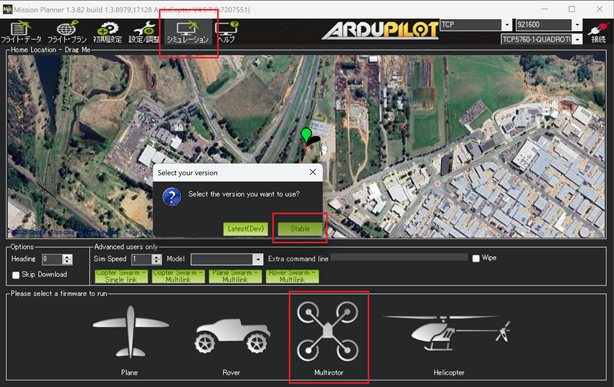

# ArduPilot MCP Server Sandbox

このリポジトリは、ArduPilot を自然言語で操作するための [MCP（Model Context Protocol）] サーバーのサンドボックスです。  
`mcp` プロトコルに対応しており、[Claude Desktop](https://claude.ai/download)や[Cline](https://cline.bot/) などの MCP 対応チャット環境から使用可能です。

  
https://youtu.be/y1WE1cDC54Y?si=iy6vdGl38aTRcFcF

## 動作環境（SITLテスト可能）

- ArduPilot (SITL or 実機)
- MAVLink 通信が `tcp:127.0.0.1:5762` で受け付け可能であること
- Python 3.10+

---

## Mission Planner のシミュレータを使う場合

ArduPilotドローンのシミュレーションを簡単に試すには、[Mission Planner](https://ardupilot.org/planner/) の内蔵シミュレータを使うのが便利です。

1. Mission Planner をインストール
2. 起動後、上部メニューの `シミュレーション` ボタンをクリック
3. 次の画面で `Multirotor（マルチローター）` を選択
4. ダイアログの `Stable` ボタンをクリック
5. ArduPilotシミュレータが起動し、tcp:127.0.0.1:5762 で待ち受けを開始します



## セットアップ手順

### 1. Python 環境の準備

- Python 3.10+ 推奨
- Windows / macOS / Linux 対応

### 2. 依存パッケージのインストール
```
pip install -r requirements.txt
```

### 3. MCPサーバーの起動確認（手動実行）
```
python ardupilot_mcp_server.py
```
「MCPサーバーを起動します...」と出れば準備完了です。

## Cline との連携手順
### 1. [OpenRouter](https://openrouter.ai/) にサインアップし、APIキーを取得
### 2. VS Code に [Cline 拡張機能](https://marketplace.visualstudio.com/items/?itemName=saoudrizwan.claude-dev) をインストール
### 3. VS Code の settings.json に以下を追加：
```json
{
"cline.apiKey": "sk-xxxxxxx",
"cline.apiBaseUrl": "https://openrouter.ai/api/v1",
"cline.defaultModel": "deepseek/deepseek-chat-v3-0324:free",
"cline.mcpServers": {
    "ardupilot-controller": {
    "command": "python",
    "args": [
        "${workspaceFolder}/ardupilot_mcp_server.py"
    ],
    "env": {
        "PYTHONPATH": "${env:USERPROFILE}\\.local\\lib\\python3.12\\site-packages"
    }
    }
}
}
```
※ python のパスや PYTHONPATH は環境に応じて調整してください。

## Claude Desktop からの使用方法（GUI連携）

### 1. [Claude Desktop](https://claude.ai/download) をインストール
### 2. 設定ファイル `claude_desktop_config.json` を開く

   Windows の場合： `C:\Users\{ユーザー名}\AppData\Roaming\Claude\claude_desktop_config.json`

### 3. 以下を追記：

```json
{
    "mcpServers": {
        "ardupilot-controller": {
        "command": "python",
        "args": [
            "C:/Users/your-user-name/path/to/ardupilot_mcp_server.py"
        ],
        "alwaysAllow": [
            "arm",
            "disarm",
            "takeoff",
            "change_mode"
        ]
        }
    }
}
```
※ パスは環境に応じて調整してください。

### 4. Claude Desktop を再起動

## 利用できるMCPツール一覧

|コマンド|	説明|
|--------|--------|
|arm()|	機体をアームします|
|disarm()|	機体をディスアームします|
|takeoff(altitude=10.0)|	指定高度まで離陸します|
|change_mode(mode="GUIDED")|	モードを変更します|

## プロンプト例（チャットでの操作）

Cline、または Claude Desktop に話しかけて、ArduPilot を自然言語で操作できます：

- 「ArduPilotをアームして」
- 「10メートルまで離陸して」
- 「モードをGUIDEDに変更して」
- 「ArduPilotをディスアームして」

※ MCP サーバーに登録されているツールに応じて、自然文が自動で変換されます。


